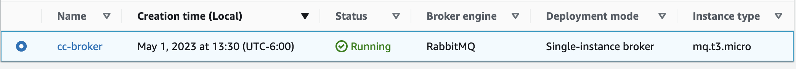
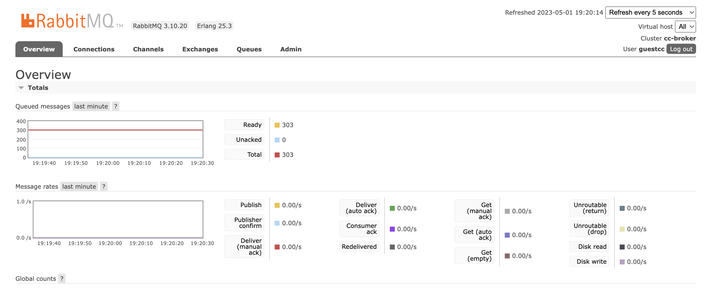
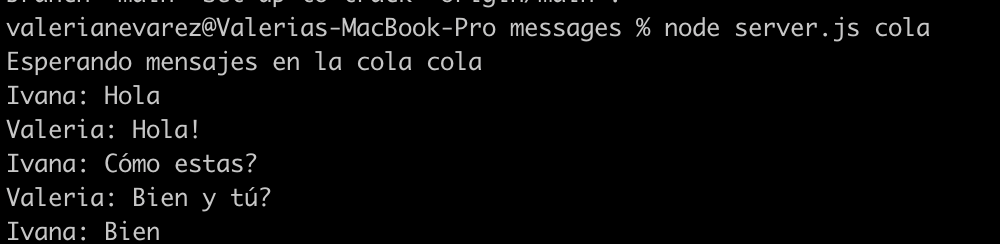
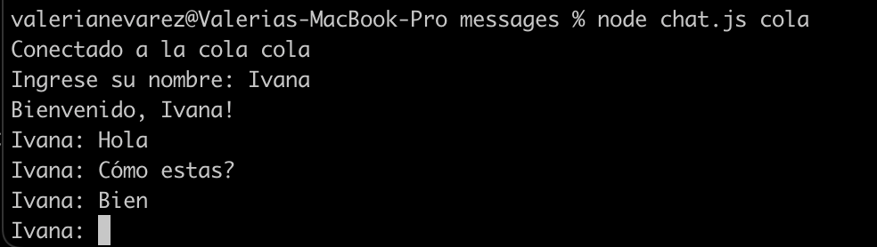

# RabbitMQ Chat

El repositorio contiene una sala de chat para varios participantes, donde el usuario debe especificar la cola de la cual quiere obtener mensajes. 

Utiliza las siguientes herramientas:
* RabbitMQ
* Amazon MQ
* JavaScript y Node
* AMQP




Para ejecutar este chat, se utilizan los siguientes comandos:

```
npm install
node server.js queue-name
node chat.js queue-name
```

Cada usuario que desee conectarse al chat debe correr estos comandos. Los últimos dos deberán ser ejecutados en dos terminales distintas. 

server.js contiene todos los mensajes de la cola especificada, mientras que chat.js es la terminal donde el usuario escribe su nombre y los mensajes que quiere enviar a la cola.

## server.js



## chat.js
